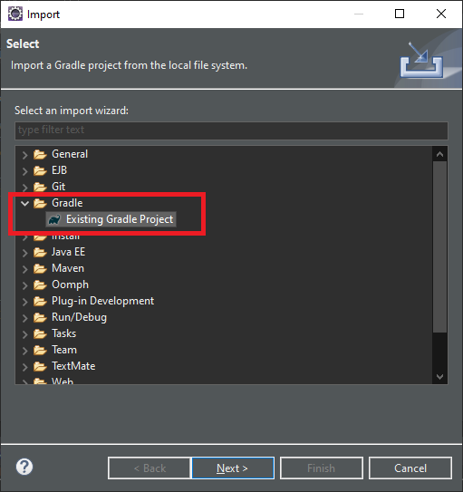
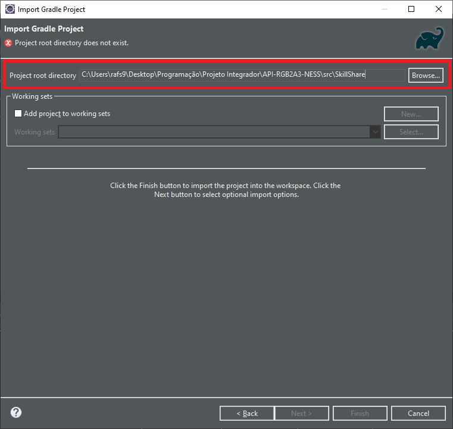
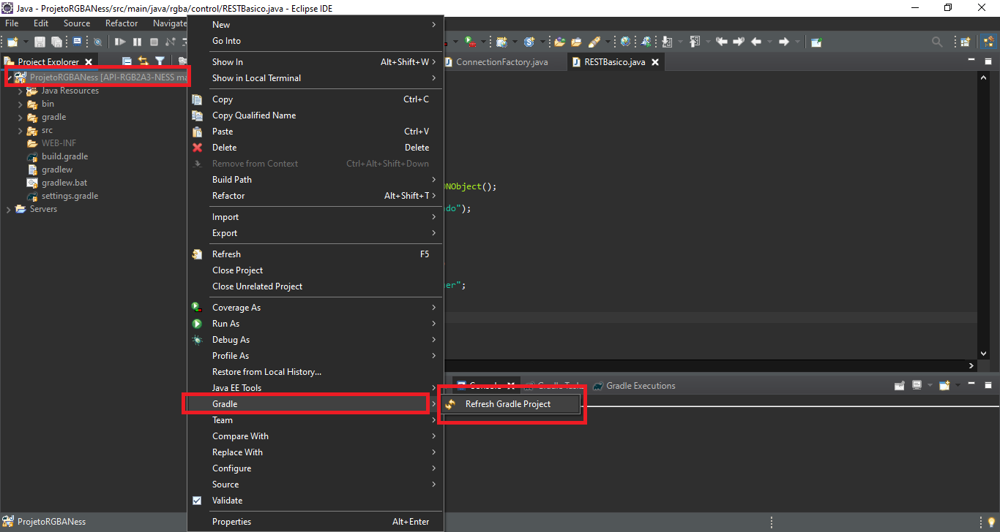
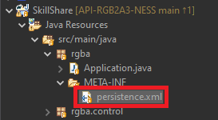
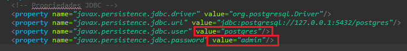
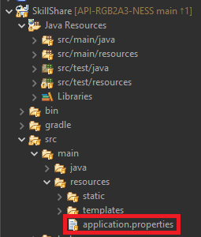
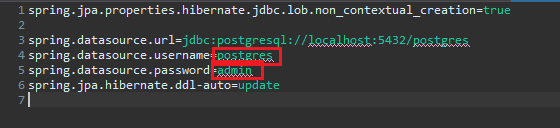

### Montando o ambiente de desenvolvimento

##### Softwares necessários

[Visual Studio Code (VSCode)](https://code.visualstudio.com/) *Recomendado para mexer com HTML, CSS e JavaScript*

[Eclipse](https://www.eclipse.org/) *Recomendado para mexer com Java*

[PostgreSQL v13.1](https://www.enterprisedb.com/downloads/postgres-postgresql-downloads)

[DBeaver](https://dbeaver.io/download/) *Facilita a conexão com o banco de dados (Opcional)*

[Java JDK 15](https://www.oracle.com/java/technologies/javase-jdk15-downloads.html)

##### Importação do projeto para o Eclipse

Após realizar o clone do repositório no GitHub, abra o Eclipse

No Eclipse, vá até ***File***, no canto da janela, e clique em ***Import...***

A seguinte janela irá abrir, nela procure por ***Gradle*** e seleciona ***Existing Gradle Project*** e clique em ***Next***

Você será direcionado para o assistente de importação do **Gradle**, em ***Project root directory*** clique em ***Browse...*** e navegue até a pasta do repositório, mas não selecione ela! Dentro dela vá para **src** e selecione **SkillShare** e importe ela

Clique em ***Next*** nas janelas seguintes e por fim em ***Finish***

Após a importação ter finalizado, clique com o direito no diretório do projeto, vá em ***Gradle*** e clique em ***Refresh Gradle Project***

Após isso aguarde alguns instantes, o Gradle irá configurar as dependências do projeto

Ao finalizar o refresh, procure por ***persistence.xml***, dentro da pasta ***META-INF***, e o abra

Nos campos marcados em vermelho na imagem, troque, **respectivamente**, pelo seu nome de usuário do banco de dados e sua senha

Agora procure por ***application.properties*** dentro de ***src/main/resources***, como na imagem a baixo e o abra

Em ***application.properties*** você fará o mesmo que realizou em ***persistence.xml***, troque os campos marcados pelas suas configurações do banco de dados

Fique atento a estes arquivos, ***persistence.xml*** e ***aplication.properties***, serão modificados várias vezes durante o desenvolver do projeto, devido as necessidades do ***Hibernate***, por isso eles não podem ser adicionados ao **.gitignore**, então sempre que fizer um **pull**, não se esqueça de alterar novamente os campos para suas configurações do banco

Com as dependências já baixadas e as devidas configurações do banco, procure por ***Application.java*** no pacote ***rgba***

Execute-o como uma aplicação Java, caso tudo corra bem, você verá o Spring sendo inicializado no console

Após isso acesse [localhost:8080](http://localhost:8080) e você verá a página inicial da aplicação

# Atenção!

O projeto foi configurado para funcionar com o **JDK 15**, verifique se, após o importar para o **Eclipse**, o projeto está vinculado a uma JDK equivalente, caso contrário, configure o ***Build Path*** do projeto para tal