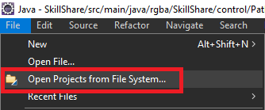
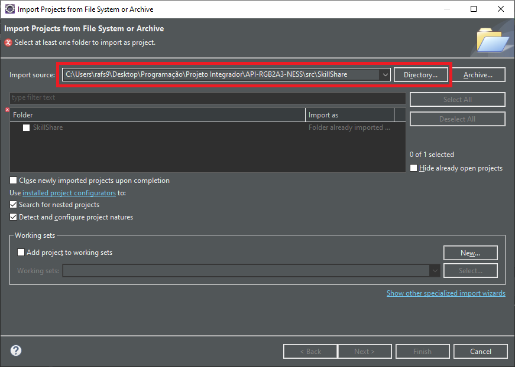
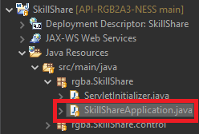

### Montando o ambiente de desenvolvimento

##### Softwares necessários

[Visual Studio Code (VSCode)](https://code.visualstudio.com/) *Recomendado para mexer com HTML, CSS e JavaScript*

[Eclipse](https://www.eclipse.org/) *Recomendado para mexer com Java*

[PostgreSQL v13.1](https://www.enterprisedb.com/downloads/postgres-postgresql-downloads)

[DBeaver](https://dbeaver.io/download/) *Facilita a conexão com o banco de dados (Opcional)*

[Java JDK 15](https://www.oracle.com/java/technologies/javase-jdk15-downloads.html)

# Atenção!

Antes de iniciar os procedimentos abaixo, certifique-se que seu **Eclipse** esteja com o JDK 15 como padrão

 

#### Importação do projeto para o Eclipse

Após realizar o clone do repositório no GitHub, abra o Eclipse

No Eclipse, vá até ***File***, no canto da janela, e clique em ***Open Projects from File System...***

A seguinte janela irá abrir, nela, clique em ***Directory...*** e navegue para a pasta ***SkillShare*** **DENTRO** de ***src*** no repositório clonado. Após isso clique em ***Finish***

Aguarde o **Maven** realizar o download das dependências

Quando finalizado, procure na navegação lateral por ***SkillShareApplication.java***, como na imagem abaixo e o execute

Caso tudo corra bem, você verá o Spring sendo inicializado no console

Após isso acesse [localhost:8080](http://localhost:8080) e você verá a página inicial da aplicação

